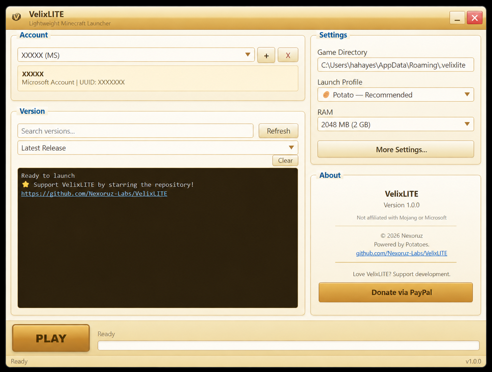

# 🥔 VelixLITE

**The Lightweight Minecraft Launcher**

*Powered by Potatoes.*

Tired of slow, bloated launchers? **VelixLITE** is a fast and simple Minecraft launcher for Windows that gets you in-game quickly — no account verification walls, no 500 MB downloads, no nonsense. Just pick a version, pick your potato level, and hit **PLAY**.

## ⬇️ Download

Grab the latest release from the [Releases](https://github.com/Nexoruz-Labs/VelixLITE/releases) page. Windows 10/11 required.

## ✨ Features

- **Microsoft & Offline accounts** — Log in with your Microsoft account for full online play, or create an offline account to start instantly. Accounts are stored encrypted on your device.
- **Any Minecraft version** — Play the latest release or snapshot, or any older version. Search and refresh with one click.
- **Potato profiles** — Four built-in performance profiles that tune RAM, garbage collection and CPU priority for your machine:
  - 🪫 **Emergency Potato** — for low-end PCs (4–8 GB RAM)
  - 🥔 **Potato** — the balanced default
  - 🥔🥔 **Potato++** — faster startup for 8+ GB systems
  - 👑 **God Potato** — maximum optimizations (ZGC, most RAM, high priority)
- **Manual tuning** — Override RAM or add your own JVM arguments anytime.
- **Smart Java** — Finds your installed Java automatically, and can install a runtime if you don't have one.
- **Display options** — Windowed, fullscreen or borderless, plus an optional "force resolution" mode that switches your desktop resolution for the session and restores it when you quit.
- **Live console** — Watch every step in a color-coded log, with sensitive data redacted and a **Report Issue** button if something goes wrong.

## 🎮 How to Use

1. **Launch VelixLITE**
2. **Add an account** — Microsoft or Offline
3. **Pick a version** — or search for it
4. **Choose a profile** — Emergency Potato 🪫 → God Potato 👑
5. **Press PLAY** 🥔

That's it. The launcher handles downloads, assets, and Java setup for you.

## ❓ FAQ

**Do I need Minecraft to use this?**
Microsoft accounts need an Xbox/Minecraft profile to join online servers. Offline accounts work for single-player without a purchase.

**Is VelixLITE free?**
Yes — free to use, forever. It's open source under the GPL-3.0 license.

**Why potatoes?**
The launcher is optimized for "potato" PCs, so it felt right. 🥔

## 💬 Support

- Found a bug? Open an [issue](https://github.com/Nexoruz-Labs/VelixLITE/issues)
- Love VelixLITE? **Star the repository** ⭐ — it helps more people find it

## 📜 License

VelixLITE is licensed under the [GNU General Public License v3.0](LICENSE).

---

**Disclaimer:** VelixLITE is NOT an official Minecraft product and is NOT approved by or associated with Mojang or Microsoft. "Minecraft" is a trademark of Mojang AB.
